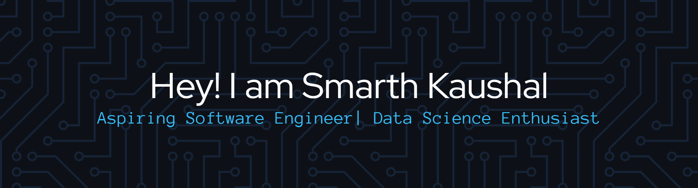

  
  &nbsp;&nbsp;&nbsp;
  

  <h4>
    <i>
      "A computer is like a violin — you can imagine it making beautiful music,
      but you have to learn how to play it."
    </i>
  </h4>

  I see technology not merely as lines of code, but as an instrument that
  blends logic with creativity.
    
  Just like a violin requires discipline, patience, and practice to produce harmony, I believe computing demands the same. Through machine learning, automation, computer networks, and system-level thinking,
  I strive to compose solutions that are efficient, meaningful, and impactful — transforming ideas into digital symphonies.

  <h1>🎻 My Instruments</h1>

### Languages

  

### Backend & Databases

  
  

### Data Science & Analytics

  &nbsp;
  &nbsp;
  &nbsp;
  &nbsp;
  

### Cloud & DevOps

  <a href="https://skillicons.dev">&nbsp;&nbsp;</a>

### Networking & Tools

  
  &nbsp;
  

<h1 align="center">📊 GitHub Analytics</h1>

  
  

  

<h1 align="center">Let's Connect</h1>

 

  

