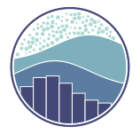

  
   
  <b>Computer Science Undergrad @TIET | Software Engineering × Machine Learning</b>
    

  
  &nbsp;&nbsp;
  

---

  <h3>न हि ज्ञानेन सदृशं पवित्रमिह विद्यते ॥</h3>
  <b><i>“There is nothing in this world as pure and sacred as knowledge.”</i></b>

  - श्रीमद्भगवद्गीता (अध्याय 4, श्लोक 38)

 

I see technology not merely as lines of code, but as an instrument that blends logic with purpose — solving real-world problems and creating solutions that make a difference in our lives.

Just as a violin requires discipline, patience, and practice to create harmony, I believe technology demands the same. Growth comes from curiosity and persistence — there is always something new to explore, something new to build, and a better way to improve. Through machine learning, automation, and system-level thinking, I strive to turn ideas into practical solutions and continuously refine my craft.

**Keep learning. Keep building. Keep moving.**

  <h2>💻 Tech Stack</h2>

### Languages

  

### Backend & Databases

  
  

### Data Science & Analytics

  &nbsp;
  &nbsp;
  &nbsp;
  &nbsp;
  

### Cloud & DevOps

  <a href="https://skillicons.dev">&nbsp;&nbsp;</a>

### Networking & Tools

  
  &nbsp;
  

 

  <h2>📊 GitHub Analytics</h2>

  
  

 

  <h2>🤝Let's Connect</h2>

  

  

